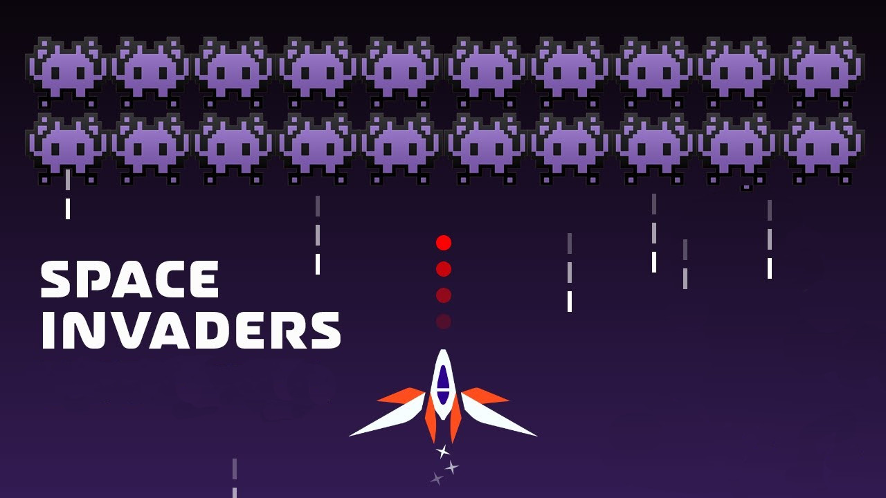

<h1 align="center">
    
</h1>

  <a href="#-tecnologias">Tecnologias</a>&nbsp;&nbsp;&nbsp;|&nbsp;&nbsp;&nbsp;
  <a href="#-projeto">Projeto</a>&nbsp;&nbsp;&nbsp;|&nbsp;&nbsp;&nbsp;
  <a href="#memo-licença">Licença</a>

  

## 🚀 Tecnologias

Tecnologias usadas:

- Html Css e Javascript

## 💻 Projeto

Space Invaders é um jogo clássico que você deve encontrar em qualquer arcade baseado em retro. 

Surpreendentemente, codificá-lo com JavaScript não é tão difícil, só precisamos conhecer alguns conceitos sobre renderização de imagens, física e interação de objetos.

---

## :memo: Licença

Esse projeto está sob a licença MIT. Veja o arquivo [LICENSE](LICENSE.md) para mais detalhes.

---

## referencia

<a href="https://www.youtube.com/watch?v=MCVU0w73uKI">Tutorial - Chris Courses</a>
